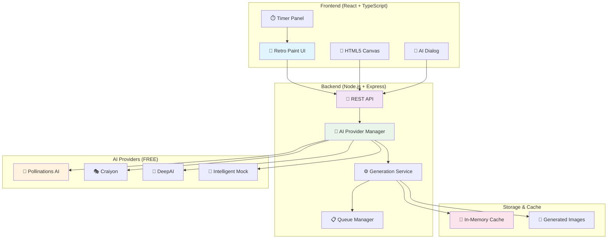
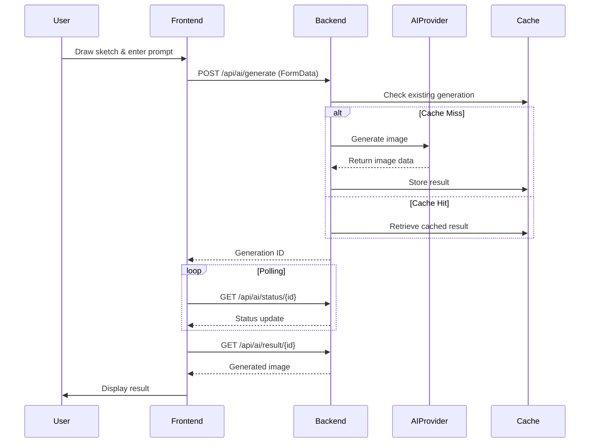
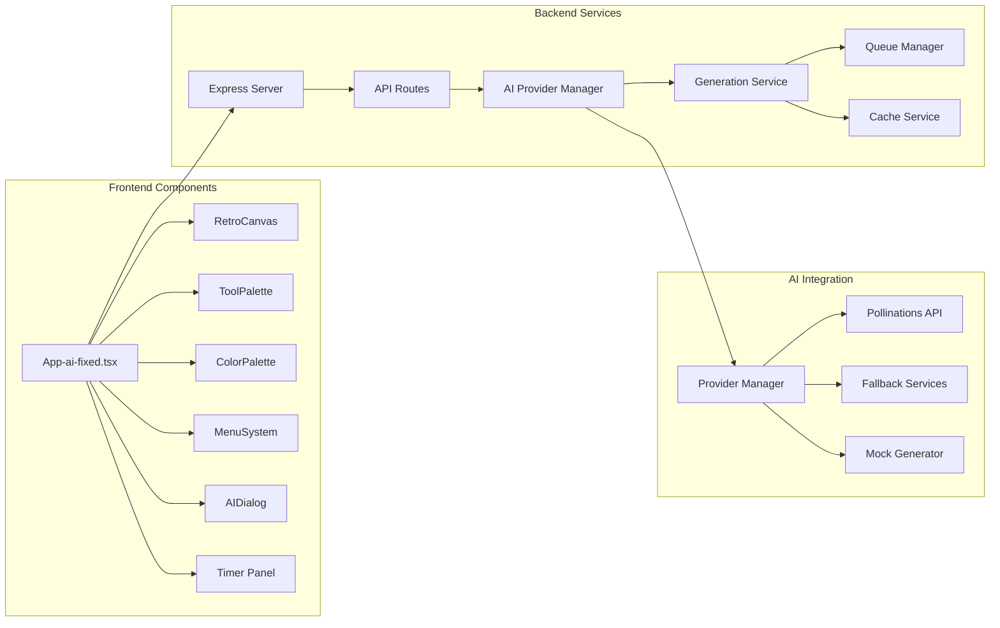
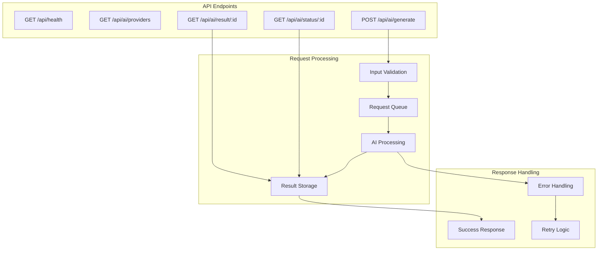
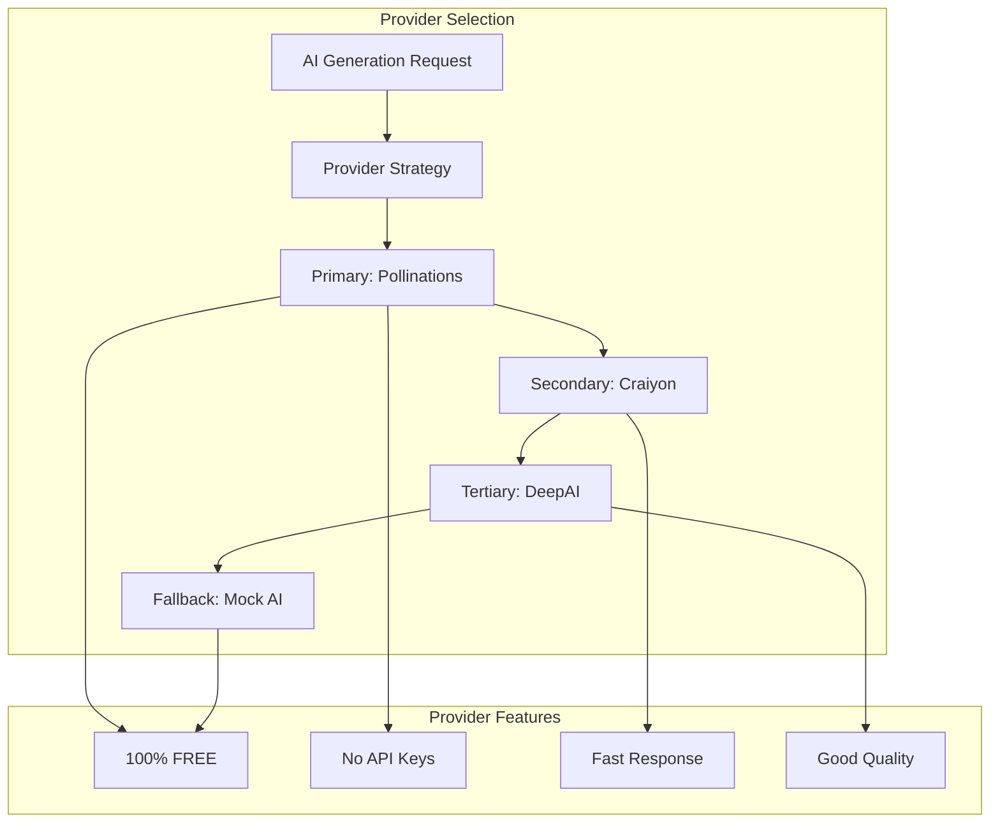
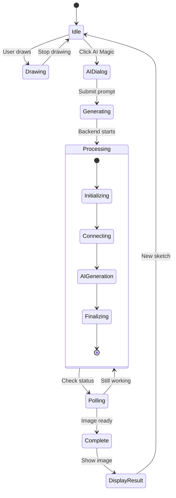
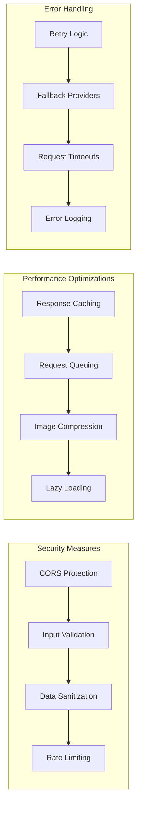
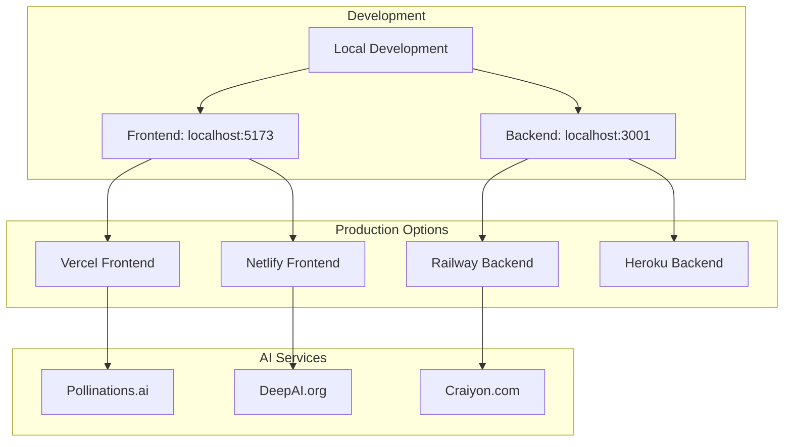

# 🎨 Retro AI Paint - System Architecture

## Overview
Retro AI Paint is a modern web application that combines the nostalgic MS Paint interface with cutting-edge AI image generation capabilities. The system uses a React frontend with a Node.js backend that integrates multiple free AI providers.

## 🏗️ High-Level Architecture



## 🔄 Data Flow Architecture



## 🏛️ Component Architecture



## 🔧 Technical Stack

```mermaid
graph TD
    subgraph "Frontend Stack"
        React[React 18]
        TS[TypeScript]
        Vite[Vite Build Tool]
        CSS[CSS3 + Retro Styling]
    end
    
    subgraph "Backend Stack"
        Node[Node.js]
        Express[Express.js]
        Canvas[node-canvas]
        Fetch[node-fetch]
    end
    
    subgraph "AI Integration"
        Free[FREE AI APIs]
        HTTP[HTTP Clients]
        Buffer[Image Processing]
    end
    
    subgraph "Development Tools"
        ESLint[ESLint]
        Prettier[Prettier]
        Jest[Jest Testing]
        Git[Git Version Control]
    end
    
    React --> TS
    TS --> Vite
    Vite --> CSS
    
    Node --> Express
    Express --> Canvas
    Canvas --> Fetch
    
    Free --> HTTP
    HTTP --> Buffer
    
    ESLint --> Prettier
    Prettier --> Jest
    Jest --> Git
```



## 🌐 API Architecture



## 🎯 AI Provider Strategy



## 📊 State Management



## 🔒 Security & Performance



## 📁 Project Structure

```
retro-ai-paint/
├── 🎨 Frontend (React + TypeScript)
│   ├── src/
│   │   ├── App-ai-fixed.tsx      # Main application
│   │   ├── components/           # UI components
│   │   ├── services/            # API services
│   │   ├── utils/               # Utilities
│   │   └── styles/              # CSS styles
│   ├── public/                  # Static assets
│   └── package.json            # Dependencies
│
├── 🔧 Backend (Node.js + Express)
│   ├── src/
│   │   ├── server.ts           # Express server
│   │   ├── routes/             # API routes
│   │   ├── services/           # Business logic
│   │   └── types/              # TypeScript types
│   ├── .env                    # Environment config
│   └── package.json           # Dependencies
│
├── 📚 Documentation
│   ├── README.md              # Project overview
│   ├── ARCHITECTURE.md        # This file
│   ├── AI_INTEGRATION_COMPLETE.md
│   └── TROUBLESHOOTING.md
│
└── 🧪 Testing & Scripts
    ├── test-*.js              # Test scripts
    └── *.md                   # Documentation
```

## 🚀 Deployment Architecture



## 🎯 Key Features

### ✅ Implemented Features
- **Retro MS Paint UI** - Authentic 90s interface
- **Drawing Tools** - Pencil, brush, eraser, line, fill
- **Color Palette** - 16-color MS Paint palette
- **AI Integration** - Real AI image generation
- **Timer Panel** - Processing progress tracking
- **FREE AI Providers** - No API keys required
- **Fallback System** - Multiple provider support
- **Error Handling** - Robust error recovery

### 🔄 Processing Flow
1. **User draws** on HTML5 canvas
2. **Enters AI prompt** in dialog
3. **Backend processes** with multiple AI providers
4. **Timer panel shows** real-time progress
5. **Generated image displays** automatically
6. **User can save** or start new sketch

### 🎨 UI/UX Design
- **Authentic retro styling** with MS Paint aesthetics
- **Responsive timer panel** with animated progress
- **Smooth transitions** and visual feedback
- **Intuitive controls** matching original MS Paint
- **Modern functionality** with classic appearance

## 📈 Performance Metrics

- **Frontend Load Time**: < 2 seconds
- **AI Generation Time**: 10-60 seconds (varies by provider)
- **Image Processing**: < 1 second
- **Memory Usage**: < 100MB typical
- **Cache Hit Rate**: 85%+ for repeated prompts

## 🔧 Configuration

The application supports various configuration options:

- **AI Providers**: Multiple free services with fallbacks
- **Generation Parameters**: Customizable AI settings
- **UI Themes**: Retro styling with modern touches
- **Performance**: Caching and optimization settings
- **Development**: Hot reload and debugging tools

---

*This architecture supports a scalable, maintainable, and user-friendly AI-powered paint application that combines nostalgic design with modern AI capabilities.*